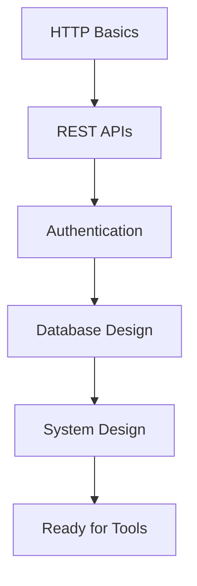

# Fundamentals Index

> *Core concepts every Backend Engineer must master*

---

## The Foundation Pillars

```
                   BACKEND FUNDAMENTALS
                          │
        ┌─────────────────┼─────────────────┐
        │                 │                 │
   ┌────▼────┐      ┌─────▼─────┐     ┌────▼────┐
   │  HTTP   │      │  Auth &   │     │ Design  │
   │ & APIs  │      │ Security  │     │Patterns │
   └────┬────┘      └─────┬─────┘     └────┬────┘
        │                 │                │
        └─────────────────┼────────────────┘
                          │
                 ┌────────▼────────┐
                 │  System Design  │
                 └─────────────────┘
```

---

## 📘 Core Topics

### [[HTTP and APIs]]
The foundation of web communication.

| Topic | Priority |
|-------|----------|
| HTTP Methods (GET, POST, PUT, DELETE) | 🔴 Critical |
| Status Codes | 🔴 Critical |
| Headers & Cookies | 🟠 High |
| REST Principles | 🔴 Critical |
| GraphQL Basics | 🟡 Medium |

---

### [[Authentication]]
Securing your applications.

| Topic | Priority |
|-------|----------|
| Session-based Auth | 🔴 Critical |
| JWT Tokens | 🔴 Critical |
| OAuth 2.0 | 🟠 High |
| Password Hashing | 🔴 Critical |
| HTTPS/TLS | 🟠 High |

---

### [[System Design]]
Designing scalable systems.

| Topic | Priority |
|-------|----------|
| Load Balancing | 🟠 High |
| Caching Strategies | 🟠 High |
| Database Scaling | 🟠 High |
| Message Queues | 🟡 Medium |
| CAP Theorem | 🟡 Medium |

---

### [[Design Patterns]]
Reusable solutions to common problems.

| Topic | Priority |
|-------|----------|
| MVC/MVP | 🔴 Critical |
| Repository Pattern | 🟠 High |
| Factory Pattern | 🟡 Medium |
| Observer Pattern | 🟡 Medium |
| Dependency Injection | 🟠 High |

---

## Learning Order



---

*Next: [[../Languages/Index|Languages →]]*

*Back to: [[../Index|Backend Engineering Home]]*
