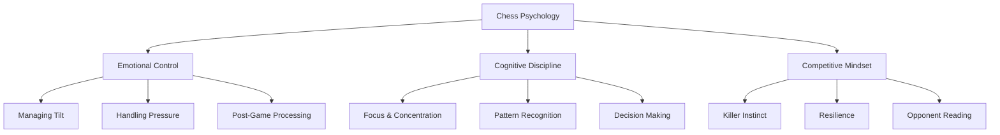
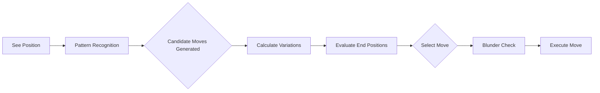

---
tags:
  - chess/psychology
  - chess/improvement
  - mental-game
difficulty: All Levels
last_updated: 2026-02-09
---

# Chess Psychology

> *"Chess is 99% tactics... but that 1% of psychology decides 99% of games."* — Adapted wisdom

Chess is a mental battlefield. Technical skill means nothing if you crumble under pressure, tilt after blunders, or fail to read your opponent. This guide covers the deep psychological aspects of chess — from managing your own mind to exploiting your opponent's weaknesses.

---

# PART 1: UNDERSTANDING YOUR OWN MIND

## 🧠 The Three Mental Pillars

Every strong chess player rests on three psychological pillars:



---

## 🔥 Emotional Control

### The Tilt Cycle

**Tilt** is the chess player's greatest enemy. It follows a predictable pattern:

```
Blunder → Frustration → Rushed Moves → More Blunders → Full Tilt → Loss
```

**Breaking the Cycle:**

| Stage | Intervention |
|-------|--------------|
| **Blunder happens** | Take a deep breath. Stand up if online. Count to 10. |
| **Frustration rises** | Remind yourself: "The position is still playable." |
| **Urge to play fast** | Force yourself to use at least 30 seconds per move. |
| **Feeling hopeless** | Look for opponent's weaknesses — they're nervous too. |

> ⚠️ **The 3-Move Rule:** After a blunder, force yourself to spend extra time on the next 3 moves. This prevents a single mistake from becoming a game-losing cascade.

---

### The Emotional Spectrum of a Game

A chess game takes you through predictable emotional phases:

| Phase | Typical Emotion | Danger | Solution |
|-------|-----------------|--------|----------|
| **Opening** | Confidence / Anxiety | Overconfidence or freezing | Trust your preparation |
| **Early Middlegame** | Excitement | Impulsive attacks | Slow down, evaluate objectively |
| **Complex Position** | Overwhelm | Paralysis, time trouble | Break position into chunks |
| **Defending** | Fear, frustration | Panic moves | "Defense is also chess" — embrace it |
| **Winning Position** | Relaxation | Letting opponent back in | Stay hungry until checkmate |
| **Losing Position** | Despair | Resignation too early | Set traps, make them prove it |
| **Endgame** | Fatigue | Technique errors | Slow down, use all your time |

---

### Managing Pre-Game Nerves

Before an important game, your body enters fight-or-flight mode. Use it.

**Reframe Anxiety as Excitement:**
- Anxiety: "I might lose, everyone will see me fail"
- Excitement: "I get to test myself against a strong opponent"

Both feel the same physically (racing heart, sweaty palms). The difference is interpretation.

**Pre-Game Routine (15-20 minutes before):**
1. **Physical:** Light walk, stretch, drink water
2. **Mental:** Visualize your opening tabiya (1.e4 c6, 1.d4 d5)
3. **Tactical:** Solve 2-3 easy puzzles (warm up pattern recognition)
4. **Breathing:** 4-7-8 technique (inhale 4s, hold 7s, exhale 8s)
5. **Affirmation:** "I trust my preparation. I will play my moves."

---

### Post-Game Emotional Processing

How you handle the end of a game affects your next one.

**After a Win:**
- Don't celebrate too hard — stay grounded
- Analyze: "What did I do well? What was lucky?"
- Avoid arrogance trap: "I'm better than my rating"

**After a Loss:**
- **First 5 minutes:** Don't analyze. Walk away. Breathe.
- **5-30 minutes:** Quick skim — one lesson only. Save deep analysis for later.
- **Later (hours/next day):** Deep, unemotional analysis.
- **Never:** Analyze while tilted. You'll reinforce bad emotional patterns.

**After a Draw:**
- Evaluate: Was it a fair result? Did you miss wins? Miss saves?
- Draws from worse positions = mental victories
- Draws from better positions = learning opportunities

> 💡 **Journaling:** Keep a brief emotional log after each game. "Felt nervous in opening, calmed down by move 15, got too relaxed when up material." Patterns will emerge.

---

## 🎯 Cognitive Discipline

### Focus and Concentration

Chess demands sustained concentration. Your brain has limited focus reserves.

**The Attention Budget:**

| Time Control | Focus Strategy |
|--------------|----------------|
| **Bullet (1 min)** | Pre-game warm-up crucial; rely on pattern recognition |
| **Blitz (3-5 min)** | Peak focus on key moments; coast on obvious moves |
| **Rapid (10-15 min)** | Alternate intense thinking with breathing breaks |
| **Classical (30+ min)** | Pacing is everything; take bathroom breaks strategically |

**Focus Killers:**
- 🚫 Phone notifications
- 🚫 Background noise (or wrong music)
- 🚫 Hunger/thirst
- 🚫 Uncomfortable chair/posture
- 🚫 Thinking about rating, not position

**Focus Builders:**
- ✅ Pre-game ritual (creates mental separation from life)
- ✅ Single task environment
- ✅ Caffeine (timed correctly — 20-30 min before game)
- ✅ Familiar background sounds (same music, same silence)

---

### The Decision-Making Process

Every move involves unconscious and conscious processing:



**Where Decisions Go Wrong:**

| Error Type | Cause | Prevention |
|------------|-------|------------|
| **Pattern Failure** | Don't recognize motif | Study tactics daily, review games |
| **Candidate Blindness** | Miss strong move entirely | Systematic move generation |
| **Calculation Error** | Wrong variation | Slow down, verify before moving |
| **Evaluation Error** | Misjudge resulting position | Study endgames and positional chess |
| **Execution Error** | Click wrong square / miss check | Blunder check: "Is this safe?" |

---

### The Blunder Check Protocol

Before every move, ask:

1. **Does this hang a piece?** (Look at undefended pieces)
2. **Does this allow a check?** (King safety)
3. **Does this create a tactic for my opponent?** (Forks, pins, skewers)
4. **What is my opponent's best response?**

This takes 5-10 seconds but prevents >50% of blunders.

---

### Time Management Psychology

Time trouble is a self-fulfilling prophecy: panic about time causes bad moves, which cause more panic.

**The Time Trap Cycle:**
```
"I'm low on time" → Plays fast → Bad move → Falls behind → Needs to think → Less time → More panic
```

**Time Philosophy by Phase:**

| Phase | Time Allocation | Reasoning |
|-------|-----------------|-----------|
| **Opening** | 5-10% | Prepared territory, move quickly with confidence |
| **Critical Middlegame** | 60-70% | Where games are won and lost |
| **Conversion** | 20-25% | Don't rush when winning; technique matters |
| **Time Trouble** | Remaining | If here, shift to "defensive mode" |

**Defensive Mode (Under 2 minutes):**
- Play solid, prophylactic moves
- Avoid complications (even if objectively best)
- Trade pieces to simplify
- Aim for positions you understand deeply

---

## 🏆 Competitive Mindset

### The Killer Instinct

The ability to finish games when ahead separates winners from almost-winners.

**Symptoms of Weak Killer Instinct:**
- Offering draws from better positions
- "Taking it easy" when ahead
- Letting opponents back into games
- Feeling guilty about winning

**Building Killer Instinct:**

| Practice | Purpose |
|----------|---------|
| **Play on when opponents should resign** | Get used to winning won games |
| **Solve mating puzzles** | Reinforce: "The goal is checkmate" |
| **Study endgames from ahead** | Learn to convert advantages |
| **Never offer draws from better positions** | Mental commitment to winning |

> **Kasparov's Rule:** "When you're winning, look for more. When you're losing, look for tricks."

---

### Resilience: The Art of Swindling

The swindle is a beautiful thing — inducing an error from a lost position.

**Swindle Psychology:**

1. **Never give up mentally** — Your opponent can always blunder
2. **Create complexity** — Simplified positions are easier to convert
3. **Set traps** — Even if objectively bad, make them calculate
4. **Act normal** — Don't signal desperation through body language or fast play
5. **Target their weaknesses** — If they're in time trouble, complicate

**Famous Swindle Patterns:**
- Stalemate traps in endgames
- Perpetual check from lost positions
- Fortress builds against pawns
- Sudden tactical shots in "dead" positions

---

### Handling Different Game Situations

| Situation | Wrong Mindset | Right Mindset |
|-----------|---------------|---------------|
| **Playing higher-rated** | "I'll probably lose" | "They're in my range — I can beat them" |
| **Playing lower-rated** | "Easy win" | "Respect every opponent; earn the win" |
| **Must-win situation** | Panic, overpress | "Find the best moves; results follow" |
| **Must-draw situation** | Passive, scared | "Solid chess; take draws when offered" |
| **After a loss streak** | "I've forgotten how to play" | "Variance is real; trust my training" |
| **After a win streak** | "I'm invincible" | "Stay humble; every game is new" |

---

# PART 2: UNDERSTANDING YOUR OPPONENT

## 👁️ Reading Your Opponent

Chess is played between humans (mostly). Understanding your opponent gives you edge.

### Pre-Game Preparation

**Research (when possible):**
- Playing style (tactical vs positional?)
- Opening repertoire (what do they play?)
- Common mistakes (time trouble? Endgame weakness?)
- Recent form (confidence level?)

**In-Game Observation:**

| Behavior | Possible Meaning | Exploitation |
|----------|------------------|--------------|
| **Fast moves early** | Well-prepared; confident | Don't panic — they're in their zone |
| **Slow moves early** | Uncomfortable; out of book | Apply pressure, keep them thinking |
| **Stands up frequently** | Nervous or confident | Watch for patterns |
| **Avoiding eye contact** | Concentrating or scared | Maintain your own focus |
| **Sighing/fidgeting** | Frustration | Stay calm; don't let their energy affect you |
| **Offering draw** | Unsure of position | Evaluate objectively — often good for you |

---

### Psychological Player Types

Different players have different vulnerabilities:

#### The Tactician 🔥
- **Style:** Sharp, sacrificial, attack-oriented
- **Strength:** Calculates well under fire
- **Weakness:** Impatient in quiet positions, poor endgames
- **Counter-Strategy:** Play solid, trade into endgames, avoid complications

#### The Positional Grinder ⚙️
- **Style:** Slow builds, piece maneuvering, long games
- **Strength:** Patient, excellent technique
- **Weakness:** Uncomfortable in tactical chaos
- **Counter-Strategy:** Create imbalances, generate tactics, complicate

#### The Opening Expert 📚
- **Style:** Plays 15 moves instantly, deep preparation
- **Strength:** Knows theory cold, clock advantage early
- **Weakness:** Lost when out of book
- **Counter-Strategy:** Sidelines, early deviations, make them think

#### The Patzer Punisher 🎯
- **Style:** Plays for tricks, hopes for mistakes
- **Strength:** Good at inducing errors
- **Weakness:** Crumbles against solid play
- **Counter-Strategy:** Play principled chess, don't fall for traps

#### The Clock Player ⏱️
- **Style:** Plays fast to pressure opponent's time
- **Strength:** Excellent in time trouble
- **Weakness:** May not find best moves objectively
- **Counter-Strategy:** Trust your time management, don't speed up to match them

---

### Exploiting Emotional States

When your opponent shows emotion, adapt:

| Opponent Emotion | Signs | Exploitation |
|------------------|-------|--------------|
| **Frustrated** | Sighing, fast moves, mistakes | Stay solid; let them self-destruct |
| **Overconfident** | Relaxed posture, quick play | Play for complications; they'll underestimate |
| **Nervous** | Fidgeting, checking clock, hesitation | Apply steady pressure; make them decide |
| **Tilted** | Visible anger, impulsive moves | Don't get cocky; finish professionally |
| **Resigned internally** | Slumped, no longer calculating | Don't relax! Finish the game properly |

---

# PART 3: MENTAL TRAINING PROTOCOLS

## 📅 Daily Mental Exercises

### The 10-Minute Mind Warm-Up

Before chess study or games:

1. **2 min:** Deep breathing (4-7-8 pattern)
2. **3 min:** Easy puzzles (pattern activation)
3. **3 min:** Visualize a previous good game
4. **2 min:** Set intention ("Today I focus on candidate moves")

---

### Building Mental Stamina

Chess games demand 2-6 hours of concentration. Train for it.

| Week | Practice Method |
|------|-----------------|
| **1-2** | Play 15+10 rapids with full focus |
| **3-4** | Extend to 30-minute games |
| **5-6** | Play classical (45+45 or 90+30) |
| **7-8** | Play tournament-length games back-to-back |

**Between moves:** Don't check phone. Stay in the position. Breathe.

---

### Visualization Training

Elite chess players can play blindfold. You can train this:

**Level 1:** Picture your opening tabiya. Name each piece's square.
**Level 2:** Play through simple games in your head from notation.
**Level 3:** Analyze positions with eyes closed.
**Level 4:** Play blindfold bullet in your head during commutes.

---

## 🔄 Breaking Bad Habits

### Common Psychological Patterns

| Bad Habit | Root Cause | Intervention |
|-----------|------------|--------------|
| **Premature resignation** | Fear, defeatism | Rule: Never resign — make them checkmate |
| **Drawing winning positions** | Laziness, fear of losing won game | Rule: Keep playing until it's truly drawn |
| **Blurting out moves** | Impulsivity, anxiety | Rule: Hands off mouse until 100% decided |
| **Over-analyzing blunders** | Perfectionism | Rule: One lesson per game, move on |
| **Rating obsession** | External validation | Rule: Track games played, not rating |

---

### The "Next Move" Mentality

After any event — blunder, brilliancy, or draw offer — ask only:

> "What is the best move in THIS position?"

The past doesn't exist on the chessboard. Only the current position matters.

---

## 🧘 Mindfulness for Chess

### The Chess-Meditation Link

Chess and meditation share the same requirements:
- Sustained attention on a single object
- Noticing when mind wanders
- Returning to focus without judgment

**5-Minute Chess Meditation:**
1. Set up a complex position
2. Close your eyes and visualize it
3. When thoughts wander, return to the position
4. Open eyes, verify accuracy
5. Repeat with new position

---

### Staying Present During Games

**Unhelpful Thoughts:**
- "If I lose this I'll drop 50 rating points"
- "I can't believe I missed that earlier"
- "My opponent is so lucky"

**Helpful Thoughts:**
- "What does this position require?"
- "What are my candidate moves?"
- "What's my opponent's threat?"

Redirect attention to the BOARD, not the story.

---

# PART 4: TOURNAMENT PSYCHOLOGY

## 🏟️ Preparing for Tournaments

### The Week Before

| Day | Focus |
|-----|-------|
| **7 days out** | Technical review — opening refreshers, tactics |
| **5 days out** | Practice games at tournament time control |
| **3 days out** | Light study only; allow information to consolidate |
| **1 day out** | Rest, visualization, logistics (hotel, travel, food) |
| **Tournament day** | Routine: warm-up, breakfast, arrive early |

---

### Between Rounds

The time between games matters:

**Immediately after:**
- Quick debrief (1-2 minutes max)
- Walk, stretch, bathroom
- Eat and hydrate

**1+ hour before next game:**
- Don't analyze previous game deeply
- Light puzzles or opening review
- Stay calm, conserve mental energy

---

### Tournament-Specific Psychology

| Situation | Mental Approach |
|-----------|----------------|
| **First round nerves** | Everyone feels it; trust your preparation |
| **Playing up (higher section)** | Nothing to lose; play freely |
| **Playing down (expected to win)** | Respect opponent; don't underestimate |
| **Multiple losses** | Each game is independent; focus forward |
| **Fighting for a prize** | Same chess, higher stakes — don't change style |

---

## 💭 The Champion's Mindset

What separates club players from titled players is often mental, not tactical.

### Beliefs of Strong Players:

1. **"I belong at this level."** — No imposter syndrome
2. **"Mistakes are learning opportunities."** — Growth mindset
3. **"My opponent must prove they can beat me."** — Quiet confidence
4. **"I trust my calculation."** — No double-checking into time trouble
5. **"I can beat anyone on a good day."** — No psychological capitulation

---

### Developing Competitive Confidence

Confidence comes from evidence. Build your confidence bank:

- Keep a "best games" folder — review when feeling low
- Track improvement metrics (puzzle rating, accuracy trends)
- Note when you beat higher-rated players
- Remember: Every GM was once your rating

---

# PART 5: STYLE-SPECIFIC PSYCHOLOGY

## ♟️ Psychology for Solid/Positional Players

*(This applies to you as a QGD and Caro-Kann player)*

### Your Psychological Profile:

- **Strength:** Patience, resilience, endgame confidence
- **Weakness:** Can be too passive, may lack killer instinct
- **Common Emotion:** Frustration when "nothing happens"

### Mental Adjustments:

| Challenge | Solution |
|-----------|----------|
| "My openings are boring" | Embrace it — boring for you is frustrating for them |
| "I'm cramped every game" | Cramped ≠ losing; trust the structure |
| "I never get attacks" | Positional wins ARE wins; value technique |
| "Opponents always attack me" | Defending successfully is demoralizing for attackers |

### Against Aggressive Opponents:

1. **Stay calm** — They want you to panic
2. **Trade pieces** — Reduce their attack potential
3. **Counter in the center** — Attacks work best with closed center
4. **Trust your structure** — Caro-Kann and QGD are famously solid
5. **Target overextension** — Aggressive players often overreach

---

## ⚔️ When You Need to Be Aggressive

Sometimes solid play isn't enough. Know when to shift gears:

| Situation | Aggression Required |
|-----------|---------------------|
| Must-win (tournament situation) | Moderate — avoid dead draws |
| Opponent is defensive specialist | High — make them uncomfortable |
| You're in a familiar sharp line | High — use your preparation |
| You're much higher rated | Moderate — press but don't overforce |

**Sharp Weapons in Your Repertoire:**
- Caro-Kann: The Fantasy counter (3.f3 dxe4 4.fxe4 e5)
- QGD: Cambridge Springs (6...Qa5)
- Both: Avoid exchanges, keep pieces on the board

---

# Quick Reference Cards

## Pre-Game Checklist
- [ ] Hydrated, fed, rested
- [ ] Equipment ready (board, clock, notation)
- [ ] Warm-up complete (puzzles, breathing)
- [ ] Mentally present (no external worries)
- [ ] Visualized opening tabiya
- [ ] Intention set for the game

## During-Game Reminders
- [ ] Blunder check before every move
- [ ] Don't rush after opponent's quick moves
- [ ] Breathe during critical moments
- [ ] Stay objective after mistakes
- [ ] Manage time proactively
- [ ] Stay in the present position

## Post-Game Protocol
- [ ] Brief acknowledgment of result
- [ ] 5-minute cool-down (walk, breathe)
- [ ] One lesson extraction (not deep analysis)
- [ ] Emotional reset before next activity
- [ ] Deep analysis later (hours or next day)

---

## Related Notes
- [[My Repertoire - QGD and Caro-Kann]]
- [[Index]]

---

*"The winner of the game is the player who makes the next-to-last mistake."* — Tartakower

*Last Updated: 2026-02-09*
