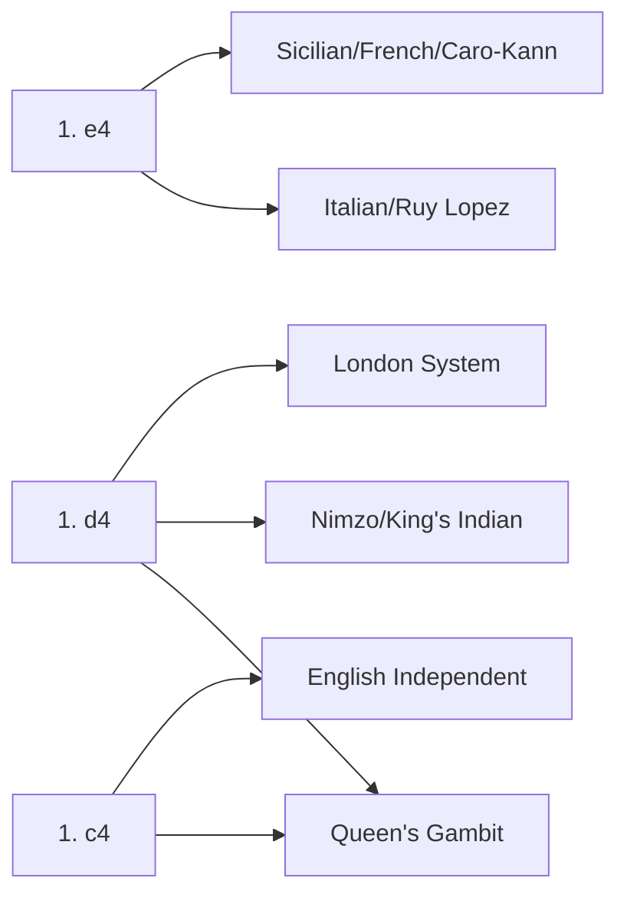

# ♟️ Chess Openings Index

A comprehensive guide to chess openings for building a strong repertoire.

---

## 📊 Quick Reference

| Opening | ECO | Difficulty | Style | Best For |
|---------|-----|------------|-------|----------|
| [[The Ruy Lopez]] | C60-C99 | Intermediate/Advanced | Strategic | Classical players |
| [[The Italian Game]] | C50-C59 | Beginner/Intermediate | Tactical | Attackers |
| [[The Queens Gambit]] | D06-D69 | Intermediate | Positional | Solid players |
| [[The London System]] | D00, A46-A48 | Beginner/Intermediate | System | Low-theory players |
| [[The English Opening]] | A10-A39 | Intermediate/Advanced | Flexible | Strategic players |
| [[The Sicilian Defense]] | B20-B99 | Advanced | Tactical | Fighting players |
| [[The Caro-Kann Defense]] | B10-B19 | Intermediate | Solid | Endgame lovers |
| [[The French Defense]] | C00-C19 | Intermediate | Counter-attacking | Structure players |
| [[The Kings Indian Defense]] | E60-E99 | Advanced | Aggressive | Attackers |
| [[The Nimzo-Indian Defense]] | E20-E59 | Advanced | Positional | Technical players |
| [[The Scandinavian Defense]] | B01 | Beginner/Intermediate | Counter-attacking | Simplifiers |

---

## ⚪ White Openings
*Starting with 1. e4, 1. d4, or 1. c4*

### 👑 King's Pawn (1. e4) — ECO B00-C99
- [[The Ruy Lopez]] (C60-C99) — The "Spanish Game", strategic and classical.
- [[The Italian Game]] (C50-C59) — Direct attack on f7, great for open tactical play.

### 🏛️ Queen's Pawn (1. d4) — ECO D00-E99
- [[The Queens Gambit]] (D06-D69) — Fight for the center by sacrificing a flank pawn.
- [[The London System]] (D00, A46-A48) — A rock-solid "system" setup for consistent play.

### 🏹 Flank Openings — ECO A00-A39
- [[The English Opening]] (A10-A39) — Control the center from the side (1. c4).

---

## ⚫ Black Defenses
*Responses to White's first move*

### ⚔️ Against 1. e4 — ECO B00-C99
- [[The Sicilian Defense]] (B20-B99) — Aggressive, asymmetrical, and high-winning chances.
- [[The Caro-Kann Defense]] (B10-B19) — The "Iron Wall" defense, extremely solid.
- [[The French Defense]] (C00-C19) — Sharp counter-attacking with solid pawn chains.
- [[The Scandinavian Defense]] (B01) — Immediate center counter (1... d5).

### 🛡️ Against 1. d4 — ECO D00-E99
- [[The Kings Indian Defense]] (E60-E99) — Hypermodern and aggressive kingside attack.
- [[The Nimzo-Indian Defense]] (E20-E59) — The most reliable and strategic defense against 1. d4.

---

## 📚 Recommended Study Order

### For Beginners (Under 1200)
1. **[[The Italian Game]]** — Learn basic tactics and attacking ideas
2. **[[The London System]]** — Easy-to-learn system opening
3. **[[The Scandinavian Defense]]** — Simple response to 1. e4

### For Intermediate (1200-1800)
1. **[[The Ruy Lopez]]** — Master classical chess principles
2. **[[The Queens Gambit]]** — Understand central control
3. **[[The Caro-Kann Defense]]** — Build solid positional skills

### For Advanced (1800+)
1. **[[The Sicilian Defense]]** — Deep theoretical study
2. **[[The Kings Indian Defense]]** — Dynamic counterplay
3. **[[The Nimzo-Indian Defense]]** — High-level positional chess

---

## 📈 Progress Tracker
- [ ] Master the Najdorf Sicilian (B90-B99)
- [ ] Learn the Marshall Attack in the Ruy Lopez (C89)
- [ ] Perfect the London System move order (D00)
- [ ] Study the Nimzo-Indian Classical (E32-E39)
- [ ] Understand the King's Indian Mar del Plata (E97)

---

## 🔀 Common Transpositions

---

## 📖 Opening Books (Recommended)

| Stage | Book | Author |
|-------|------|--------|
| Beginner | *Fundamental Chess Openings* | Paul van der Sterren |
| Intermediate | *Chess Openings for Black/White Explained* | Lev Alburt |
| Advanced | *Modern Chess Openings (MCO)* | Nick de Firmian |
