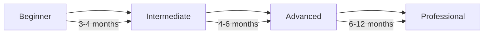

# Data Engineering Roadmap

> *A structured path from beginner to professional Data Engineer*

---

## 🎯 The Big Picture

---

## Phase 1: Foundation (Months 1-3)

### Month 1: Programming & Databases

#### Week 1-2: SQL Fundamentals
- [ ] Basic queries (SELECT, WHERE, ORDER BY)
- [ ] JOINs (INNER, LEFT, RIGHT, FULL)
- [ ] Aggregations (GROUP BY, HAVING)
- [ ] Subqueries and CTEs
- [ ] Window functions (ROW_NUMBER, RANK, LAG, LEAD)

**Practice:** [LeetCode SQL](https://leetcode.com/problemset/database/) | [HackerRank SQL](https://www.hackerrank.com/domains/sql)

#### Week 3-4: Python Basics
- [ ] Data types, control flow, functions
- [ ] File handling (CSV, JSON, Parquet)
- [ ] pandas fundamentals
- [ ] API calls with requests
- [ ] Error handling and logging

**Practice:** [Python for Data Science](https://www.datacamp.com/tracks/python-programming)

### Month 2: Infrastructure Basics

#### Week 5-6: Linux & Command Line
- [ ] File system navigation
- [ ] Text processing (grep, awk, sed)
- [ ] Shell scripting basics
- [ ] Process management
- [ ] SSH and remote operations

#### Week 7-8: Version Control & Containers
- [ ] Git fundamentals (clone, commit, push, pull)
- [ ] Branching and merging
- [ ] Docker basics
- [ ] Docker Compose
- [ ] Container registries

### Month 3: Cloud Fundamentals

#### Week 9-10: Pick One Cloud
Choose **ONE** to start:
- [ ] **AWS**: S3, EC2, RDS, IAM basics
- [ ] **GCP**: GCS, Compute Engine, Cloud SQL
- [ ] **Azure**: Blob Storage, VMs, Azure SQL

#### Week 11-12: Cloud Data Services
- [ ] Object storage patterns
- [ ] Managed databases
- [ ] Basic networking
- [ ] Cost management basics

---

## Phase 2: Core Skills (Months 4-6)

### Month 4: Data Warehousing

#### Concepts
- [ ] OLTP vs OLAP
- [ ] Dimensional modeling (Kimball)
- [ ] Star schema and snowflake schema
- [ ] Slowly Changing Dimensions (SCD)
- [ ] Fact and dimension tables

#### Practice
- [ ] Design a star schema for an e-commerce system
- [ ] Implement SCD Type 2

### Month 5: ETL & Orchestration

#### ETL Fundamentals
- [ ] Extract patterns (APIs, databases, files)
- [ ] Transform operations (cleaning, joining, aggregating)
- [ ] Load strategies (full, incremental, upsert)
- [ ] ETL vs ELT paradigm

#### Apache Airflow
- [ ] DAGs and operators
- [ ] Task dependencies
- [ ] Variables and connections
- [ ] XComs and triggers
- [ ] Best practices

**Project:** Build a daily ETL pipeline with Airflow

### Month 6: Modern Data Stack

#### dbt (Data Build Tool)
- [ ] Models and materializations
- [ ] Tests and documentation
- [ ] Sources and refs
- [ ] Macros and packages
- [ ] dbt Cloud vs Core

#### Data Quality
- [ ] Data validation frameworks
- [ ] Great Expectations / Soda
- [ ] Monitoring and alerting
- [ ] Data observability

---

## Phase 3: Advanced Topics (Months 7-9)

### Month 7: Distributed Processing

#### Apache Spark
- [ ] RDDs and DataFrames
- [ ] Transformations vs Actions
- [ ] Spark SQL
- [ ] PySpark
- [ ] Performance tuning (partitioning, caching)

**Project:** Process 1TB+ dataset with Spark

### Month 8: Streaming & Real-time

#### Apache Kafka
- [ ] Topics, partitions, offsets
- [ ] Producers and consumers
- [ ] Consumer groups
- [ ] Kafka Connect
- [ ] Schema Registry

#### Stream Processing
- [ ] Spark Structured Streaming
- [ ] Kafka Streams / Flink basics
- [ ] Windowing and watermarks
- [ ] Exactly-once semantics

**Project:** Real-time dashboard with Kafka + Spark

### Month 9: Advanced Architecture

#### Data Architecture Patterns
- [ ] Lambda Architecture
- [ ] Kappa Architecture
- [ ] Data Mesh principles
- [ ] Data Lakehouse (Delta Lake, Iceberg)
- [ ] Medallion Architecture

#### Infrastructure as Code
- [ ] Terraform basics
- [ ] CI/CD for data pipelines
- [ ] Testing strategies
- [ ] Documentation

---

## Phase 4: Professional (Months 10-12)

### Month 10-11: Portfolio Projects

Build **3 significant projects**:

#### Project 1: Batch Pipeline
- End-to-end ELT pipeline
- Cloud-native architecture
- Automated testing
- Documentation

#### Project 2: Streaming Pipeline
- Real-time ingestion
- Stream processing
- Live dashboards
- Error handling

#### Project 3: Full Data Platform
- Multiple data sources
- Data warehouse / lakehouse
- Orchestration
- Data quality
- Visualization

### Month 12: Job Preparation

#### Technical Preparation
- [ ] System design practice
- [ ] SQL complex queries
- [ ] Python coding challenges
- [ ] Cloud architecture questions
- [ ] Behavioral questions

#### Portfolio
- [ ] GitHub profile polished
- [ ] Project READMEs complete
- [ ] Blog posts (2-3 technical)
- [ ] LinkedIn optimized

---

## Skills Checklist

### Must-Have ✅
- [ ] SQL (advanced level)
- [ ] Python (intermediate level)
- [ ] One cloud platform (deep knowledge)
- [ ] Airflow or similar orchestrator
- [ ] Spark basics
- [ ] Git proficiency
- [ ] Docker & containers
- [ ] Data modeling

### Should-Have 🎯
- [ ] dbt
- [ ] Kafka basics
- [ ] Terraform basics
- [ ] CI/CD understanding
- [ ] Data quality tools
- [ ] Second cloud platform

### Nice-to-Have ⭐
- [ ] Scala
- [ ] Kubernetes
- [ ] Advanced streaming (Flink)
- [ ] Data governance
- [ ] ML pipelines

---

## Weekly Schedule Template

| Day | Morning (1h) | Evening (2h) |
|-----|--------------|--------------|
| **Mon** | SQL practice | Course/Tutorial |
| **Tue** | Python coding | Project work |
| **Wed** | Documentation reading | Project work |
| **Thu** | Cloud hands-on | Course/Tutorial |
| **Fri** | Review & notes | Project work |
| **Sat** | Deep dive topic | Project work |
| **Sun** | Rest / Light reading | Community engagement |

---

## Milestones & Checkpoints

| Milestone | Timeline | Validation |
|-----------|----------|------------|
| **SQL Proficiency** | Month 1 | Solve 50+ LeetCode SQL problems |
| **First Pipeline** | Month 3 | Build local ETL with Python |
| **Cloud Certified** | Month 4 | Any associate-level cert |
| **Airflow Pipeline** | Month 5 | Production-ready DAG |
| **Spark Project** | Month 7 | Process large dataset |
| **Streaming** | Month 8 | Real-time pipeline |
| **Portfolio Ready** | Month 11 | 3 projects on GitHub |
| **Job Ready** | Month 12 | Pass mock interviews |

---

*Track your progress: [[Learning Path/Progress Tracker|My Progress →]]*

*Back to: [[Index|Data Engineering Home]]*
