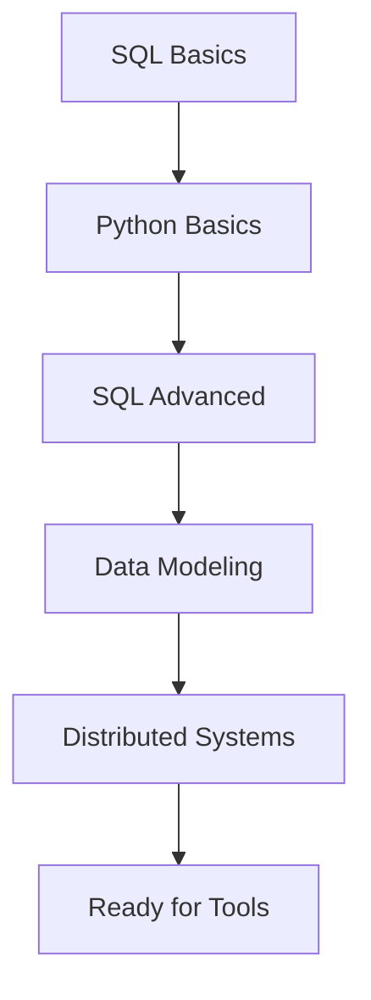

# Fundamentals Index

> *Core concepts every Data Engineer must master*

---

## The Foundation Pillars

```
                    DATA ENGINEERING FUNDAMENTALS
                              │
        ┌─────────────────────┼─────────────────────┐
        │                     │                     │
   ┌────▼────┐          ┌─────▼─────┐         ┌────▼────┐
   │   SQL   │          │  Python   │         │  Data   │
   │ Mastery │          │   for DE  │         │Modeling │
   └────┬────┘          └─────┬─────┘         └────┬────┘
        │                     │                    │
        └─────────────────────┼────────────────────┘
                              │
                    ┌─────────▼─────────┐
                    │   Distributed     │
                    │     Systems       │
                    └───────────────────┘
```

---

## 📘 Core Topics

### [[SQL Mastery]]
The language of data. Every DE speaks SQL fluently.

| Topic | Priority |
|-------|----------|
| JOINs & Subqueries | 🔴 Critical |
| Window Functions | 🔴 Critical |
| CTEs & Recursive Queries | 🟠 High |
| Query Optimization | 🟠 High |
| DDL & Constraints | 🟡 Medium |

---

### [[Python for Data Engineering]]
Your primary programming tool.

| Topic | Priority |
|-------|----------|
| pandas & NumPy | 🔴 Critical |
| File Handling (CSV, JSON, Parquet) | 🔴 Critical |
| API Integration | 🟠 High |
| Concurrent Processing | 🟠 High |
| Testing & Logging | 🟡 Medium |

---

### [[Data Modeling]]
Designing data structures that scale.

| Topic | Priority |
|-------|----------|
| Star Schema | 🔴 Critical |
| Normalization | 🟠 High |
| Slowly Changing Dimensions | 🟠 High |
| Data Vault | 🟡 Medium |
| One Big Table (OBT) | 🟡 Medium |

---

### [[Distributed Systems]]
Understanding scale and reliability.

| Topic | Priority |
|-------|----------|
| CAP Theorem | 🟠 High |
| Partitioning & Sharding | 🟠 High |
| Replication | 🟡 Medium |
| Consistency Models | 🟡 Medium |
| MapReduce Paradigm | 🟡 Medium |

---

## Learning Order



### Recommended Progression

1. **Week 1-2**: SQL fundamentals
2. **Week 3-4**: Python basics + pandas
3. **Week 5-6**: Advanced SQL (window functions, CTEs)
4. **Week 7-8**: Data modeling concepts
5. **Week 9-10**: Distributed systems basics

---

## Quick Reference Cards

### SQL Cheat Sheet

```sql
-- Window Functions
SELECT 
    id,
    value,
    SUM(value) OVER (PARTITION BY category ORDER BY date) as running_total,
    ROW_NUMBER() OVER (PARTITION BY category ORDER BY value DESC) as rank,
    LAG(value, 1) OVER (ORDER BY date) as prev_value
FROM table;

-- CTE Example
WITH ranked AS (
    SELECT *, ROW_NUMBER() OVER (PARTITION BY user_id ORDER BY created_at DESC) as rn
    FROM orders
)
SELECT * FROM ranked WHERE rn = 1;
```

### Python Data Engineering Patterns

```python
# Reading different formats
import pandas as pd

# CSV
df = pd.read_csv('data.csv')

# Parquet (preferred for DE)
df = pd.read_parquet('data.parquet')

# JSON
df = pd.read_json('data.json', lines=True)

# Chunked processing for large files
for chunk in pd.read_csv('large.csv', chunksize=100000):
    process(chunk)
```

---

## Self-Assessment

Before moving to Tools, ensure you can:

- [ ] Write complex SQL queries with window functions
- [ ] Process data with pandas efficiently
- [ ] Design a star schema from requirements
- [ ] Explain CAP theorem and trade-offs
- [ ] Handle different file formats in Python
- [ ] Understand partitioning strategies

---

*Next: [[../Tools/Index|Tools & Technologies →]]*

*Back to: [[../Index|Data Engineering Home]]*
