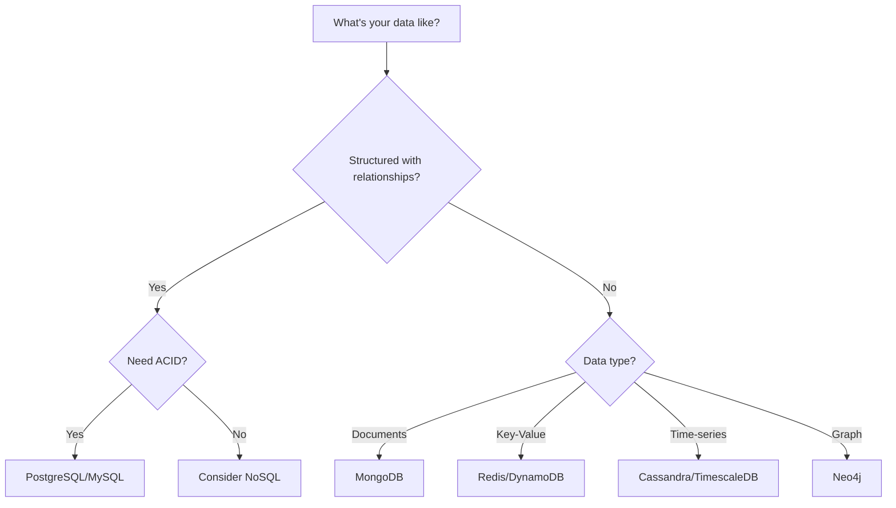

# Databases

> Choosing and designing the right data storage solutions.

---

## Back to [[System Design]]

---

## Database Types

### Relational Databases (SQL)

Structured data with ACID guarantees.

```
+----------+     +-----------+     +--------+
|  Users   | --> |  Orders   | --> | Items  |
+----------+     +-----------+     +--------+
| id       |     | id        |     | id     |
| name     |     | user_id   |     | name   |
| email    |     | total     |     | price  |
+----------+     +-----------+     +--------+
```

**Examples:** PostgreSQL, MySQL, Oracle, SQL Server

**Use When:**
- Need ACID transactions
- Complex queries with JOINs
- Data has clear relationships
- Schema is well-defined

**Characteristics:**
| Property | Description |
|----------|-------------|
| Schema | Fixed, predefined |
| Scaling | Vertical (primarily) |
| Consistency | Strong (ACID) |
| Query | SQL |

### NoSQL Databases

#### Document Stores

Store data as JSON-like documents.

```json
{
  "_id": "user123",
  "name": "John",
  "email": "john@example.com",
  "orders": [
    {"id": "o1", "total": 99.99},
    {"id": "o2", "total": 149.99}
  ]
}
```

**Examples:** MongoDB, CouchDB, Firebase

**Use When:**
- Flexible/evolving schema
- Hierarchical data
- Rapid development
- Document-centric applications

#### Key-Value Stores

Simple key-value pairs, extremely fast.

```
Key           Value
---           -----
user:123      {"name": "John", "email": "..."}
session:abc   {"userId": "123", "expires": "..."}
cache:page1   "<html>...</html>"
```

**Examples:** Redis, Memcached, DynamoDB

**Use When:**
- Caching
- Session storage
- Real-time data
- Simple lookups

#### Wide-Column Stores

Optimized for queries over large datasets.

```
Row Key    | Column Family: Profile    | Column Family: Activity
-----------+---------------------------+------------------------
user:123   | name: John, age: 30       | last_login: 2024-01-15
user:456   | name: Jane, city: NYC     | last_login: 2024-01-14
```

**Examples:** Cassandra, HBase, ScyllaDB

**Use When:**
- Time-series data
- Write-heavy workloads
- Large-scale analytics
- High availability needs

#### Graph Databases

Optimized for connected data.

```
    (John)--[FRIENDS]--(Jane)
       |                  |
   [PURCHASED]        [REVIEWED]
       |                  |
    (Book)--------------(Book)
```

**Examples:** Neo4j, Amazon Neptune, JanusGraph

**Use When:**
- Social networks
- Recommendation engines
- Fraud detection
- Knowledge graphs

---

## SQL vs NoSQL Comparison

| Aspect | SQL | NoSQL |
|--------|-----|-------|
| Schema | Fixed | Flexible |
| Scaling | Vertical | Horizontal |
| ACID | Yes | Varies |
| Joins | Native | Limited/None |
| Query Language | SQL | Varies |
| Best For | Transactions | Scale/Flexibility |

---

## ACID Properties

```
A - Atomicity     : All or nothing transactions
C - Consistency   : Data always valid
I - Isolation     : Transactions don't interfere
D - Durability    : Committed data persists
```

### Transaction Example
```sql
BEGIN TRANSACTION;
  UPDATE accounts SET balance = balance - 100 WHERE id = 1;
  UPDATE accounts SET balance = balance + 100 WHERE id = 2;
COMMIT;  -- Both succeed or both fail
```

---

## BASE Properties (NoSQL)

```
BA - Basically Available : System always responds
S  - Soft state         : State may change over time
E  - Eventual consistency: Data will eventually be consistent
```

---

## Database Replication

### Master-Slave (Primary-Replica)

```
                    Write
                      |
                      v
                +---------+
                | Primary |
                +---------+
                  /   |   \
                 /    |    \
                v     v     v
          +-------+ +-------+ +-------+
          |Replica| |Replica| |Replica|
          +-------+ +-------+ +-------+
              ^         ^         ^
              |         |         |
            Read      Read      Read
```

**Benefits:**
- Read scaling
- Fault tolerance
- Geographic distribution

**Challenges:**
- Replication lag
- Write bottleneck
- Failover complexity

### Master-Master

```
       Write/Read          Write/Read
           |                   |
           v                   v
      +---------+  sync   +---------+
      | Primary |<------->| Primary |
      +---------+         +---------+
```

**Benefits:**
- Write scaling
- No single point of failure

**Challenges:**
- Conflict resolution
- Data consistency
- Complex setup

---

## Database Partitioning (Sharding)

### Horizontal Partitioning (Sharding)

Split data across multiple databases by rows.

```
All Users Data
      |
      v
+-----------+-----------+-----------+
| Shard 1   | Shard 2   | Shard 3   |
| Users A-H | Users I-P | Users Q-Z |
+-----------+-----------+-----------+
```

### Sharding Strategies

#### 1. Range-Based Sharding
```
Shard 1: user_id 1-1,000,000
Shard 2: user_id 1,000,001-2,000,000
Shard 3: user_id 2,000,001-3,000,000
```
**Pros:** Simple, range queries efficient
**Cons:** Hotspots, uneven distribution

#### 2. Hash-Based Sharding
```
shard_id = hash(user_id) % num_shards

user_id: 12345
hash(12345) = 7823
7823 % 3 = 1 --> Shard 1
```
**Pros:** Even distribution
**Cons:** Resharding is hard, no range queries

#### 3. Directory-Based Sharding
```
+-------------+     +--------+
| Lookup      | --> | Shard  |
| Service     |     | Number |
+-------------+     +--------+
| user_id: 1  | --> | 2      |
| user_id: 2  | --> | 1      |
+-------------+     +--------+
```
**Pros:** Flexible
**Cons:** Lookup service is SPOF

### Consistent Hashing

Used for distributed caching and databases.

```
        Node A
          |
    0 ----+---- 90
    |           |
   270         180
    |           |
    +----+------+
         |
       Node B

Key "user123" hashes to 85 --> Goes to Node A
Key "order456" hashes to 200 --> Goes to Node B
```

**Benefits:**
- Minimal redistribution when nodes added/removed
- Even distribution

---

## Vertical Partitioning

Split by columns/features.

```
Users Table (Original)
+----+------+-------+--------+---------+
| id | name | email | avatar | bio     |
+----+------+-------+--------+---------+

Split into:

Users_Core               Users_Profile
+----+------+-------+    +----+--------+---------+
| id | name | email |    | id | avatar | bio     |
+----+------+-------+    +----+--------+---------+
```

---

## Indexing

### B-Tree Index (Default)
```
           [M]
          /   \
      [D,H]   [R,W]
      / | \   / | \
    [A][E][I][N][S][X]
```

Good for: Range queries, equality, sorting

### Hash Index
```
hash("john") --> Bucket 3 --> Record location
hash("jane") --> Bucket 7 --> Record location
```

Good for: Exact matches only

### Index Types

| Type | Use Case |
|------|----------|
| Primary | Unique identifier |
| Secondary | Frequently queried columns |
| Composite | Multi-column queries |
| Full-text | Text search |
| Partial | Subset of rows |

### Indexing Best Practices

```markdown
DO:
- Index columns in WHERE clauses
- Index foreign keys
- Index columns used in ORDER BY
- Use composite indexes for multi-column queries

DON'T:
- Over-index (slows writes)
- Index low-cardinality columns
- Index frequently updated columns
- Forget to analyze query patterns
```

---

## Query Optimization

### Explain Plans
```sql
EXPLAIN ANALYZE SELECT * FROM users WHERE email = 'john@example.com';

-- Output shows:
-- Seq Scan vs Index Scan
-- Rows examined
-- Execution time
```

### Common Optimizations

| Issue | Solution |
|-------|----------|
| Full table scan | Add index |
| N+1 queries | Use JOINs or batch |
| Large result sets | Pagination |
| Complex joins | Denormalization |
| Slow aggregations | Materialized views |

---

## Database Selection Guide



---

## Related Topics
- [[Caching]] - Database caching strategies
- [[Scalability]] - Scaling databases
- [[Distributed Systems]] - Consistency patterns

---

## Tags
#databases #sql #nosql #sharding #replication #indexing #system-design
