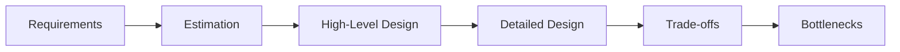

# Fundamentals

> The core concepts and structured approach to system design.

---

## Back to [[System Design]]

---

## What is System Design?

System design is the process of defining the **architecture**, **components**, **modules**, **interfaces**, and **data** for a system to satisfy specified requirements. It bridges the gap between requirements and implementation.

---

## Key Characteristics of Systems

### Functional Requirements
What the system should **do**:
- Features and capabilities
- User interactions
- Data processing needs

### Non-Functional Requirements
How the system should **behave**:

| Requirement | Description | Example Metric |
|------------|-------------|----------------|
| **Scalability** | Handle growth in users/data | 1M to 100M users |
| **Availability** | System uptime | 99.99% (52 min downtime/year) |
| **Reliability** | Correct operation | < 0.1% error rate |
| **Latency** | Response time | p99 < 200ms |
| **Throughput** | Requests per second | 10K RPS |
| **Consistency** | Data accuracy | Strong vs eventual |
| **Durability** | Data persistence | Zero data loss |

---

## Back-of-the-Envelope Estimation

### Power of 2 Reference

| Power | Exact Value | Approx | Name |
|-------|-------------|--------|------|
| 10 | 1,024 | 1 Thousand | 1 KB |
| 20 | 1,048,576 | 1 Million | 1 MB |
| 30 | 1,073,741,824 | 1 Billion | 1 GB |
| 40 | 1,099,511,627,776 | 1 Trillion | 1 TB |

### Latency Numbers Every Programmer Should Know

```
L1 cache reference                           0.5 ns
Branch mispredict                            5   ns
L2 cache reference                           7   ns
Mutex lock/unlock                           25   ns
Main memory reference                      100   ns
Compress 1K bytes with Zippy             3,000   ns
Send 1K bytes over 1 Gbps network       10,000   ns
Read 4K randomly from SSD              150,000   ns
Read 1 MB sequentially from memory     250,000   ns
Round trip within same datacenter      500,000   ns
Read 1 MB sequentially from SSD      1,000,000   ns
Disk seek                           10,000,000   ns
Read 1 MB sequentially from disk    20,000,000   ns
Send packet CA->Netherlands->CA    150,000,000   ns
```

### Quick Math for Interviews

```
Seconds in a day:     86,400    (~100K)
Seconds in a month:   2,592,000 (~2.5M)
Seconds in a year:    31,536,000 (~30M)
```

---

## Design Principles

### 1. Keep It Simple (KISS)
> Start with the simplest solution that works, then optimize.

- Avoid premature optimization
- Add complexity only when needed
- Simple systems are easier to maintain

### 2. Separation of Concerns
> Each component should have a single, well-defined responsibility.

```
+-------------+     +-------------+     +-------------+
|   Frontend  | --> |   Backend   | --> |  Database   |
| (UI/UX)     |     | (Logic)     |     | (Storage)   |
+-------------+     +-------------+     +-------------+
```

### 3. Single Point of Failure (SPOF)
> Identify and eliminate single points of failure.

**Bad:**
```
Client --> Single Server --> Database
              (SPOF)
```

**Good:**
```
Client --> Load Balancer --> Server 1 --> DB Primary
                         --> Server 2 --> DB Replica
                         --> Server 3
```

### 4. Trade-offs
> Every design decision involves trade-offs.

| Trade-off | Option A | Option B |
|-----------|----------|----------|
| Storage | More storage, faster reads | Less storage, slower reads |
| Consistency | Strong consistency, higher latency | Eventual consistency, lower latency |
| Complexity | Simple but limited | Complex but flexible |

---

## System Design Process



### Step 1: Gather Requirements
```markdown
**Questions to ask:**
- Who are the users?
- What are the main features?
- How many users? (scale)
- Read-heavy or write-heavy?
- What are the latency requirements?
- What consistency is needed?
```

### Step 2: Estimate Scale
```markdown
**Calculate:**
- Daily Active Users (DAU)
- Queries Per Second (QPS)
- Storage requirements
- Bandwidth needs
```

### Step 3: Define API
```markdown
**For each feature:**
- Define endpoints
- Specify input/output
- Consider rate limiting
```

### Step 4: High-Level Design
```markdown
**Draw:**
- Main components
- Data flow
- Client-server interaction
```

### Step 5: Deep Dive
```markdown
**Detail:**
- Database schema
- Scaling strategy
- Caching layer
- Error handling
```

---

## Common Patterns

### Client-Server Architecture
```
+--------+     HTTP/HTTPS     +--------+
| Client | <--------------->  | Server |
+--------+                    +--------+
```

### Three-Tier Architecture
```
+---------------+
| Presentation  |  <-- Web/Mobile UI
+---------------+
        |
+---------------+
|   Business    |  <-- Application Logic
+---------------+
        |
+---------------+
|     Data      |  <-- Database/Storage
+---------------+
```

### N-Tier Architecture
```
Client --> CDN --> Load Balancer --> App Servers --> Cache --> Database
```

---

## Capacity Planning Checklist

- [ ] Calculate DAU/MAU
- [ ] Estimate QPS (peak and average)
- [ ] Calculate storage needs (per user, total)
- [ ] Estimate bandwidth requirements
- [ ] Plan for 3-5 year growth
- [ ] Add safety margin (2-3x)

---

## Related Topics
- [[Scalability]] - How to grow your system
- [[Databases]] - Data storage decisions
- [[API Design]] - Interface design

---

## Tags
#fundamentals #estimation #requirements #system-design
