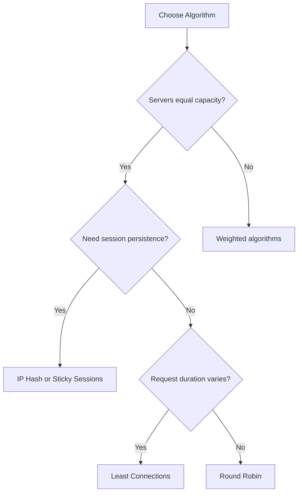

# Load Balancing

> Distributing network traffic across multiple servers to ensure reliability and performance.

---

## Back to [[System Design]]

---

## What is Load Balancing?

Load balancing is the process of distributing incoming network traffic across multiple servers to ensure no single server bears too much load. This improves responsiveness and availability.

```
Without Load Balancer:          With Load Balancer:
                                
Client --> Server (overloaded)  Client --> Load Balancer --> Server 1
                                                         --> Server 2
                                                         --> Server 3
```

---

## Load Balancer Types

### Layer 4 (Transport Layer)

Operates at TCP/UDP level. Routes based on IP and port.

```
Client:Port --> LB --> Server (based on IP/Port only)
                   
- No packet inspection
- Very fast
- No content-based routing
```

**Use Cases:** Simple TCP load balancing, gaming, streaming

### Layer 7 (Application Layer)

Operates at HTTP/HTTPS level. Can inspect content.

```
GET /api/users HTTP/1.1     --> API Server
GET /images/logo.png        --> Static Server
GET /api/v2/orders          --> New API Server

Headers, cookies, URL path can influence routing
```

**Use Cases:** Web applications, API routing, A/B testing

### Comparison

| Feature | Layer 4 | Layer 7 |
|---------|---------|---------|
| Speed | Faster | Slower |
| Flexibility | Limited | High |
| SSL Termination | No | Yes |
| Content Routing | No | Yes |
| Caching | No | Yes |
| Compression | No | Yes |

---

## Load Balancing Algorithms

### 1. Round Robin

Requests distributed sequentially.

```
Request 1 --> Server 1
Request 2 --> Server 2
Request 3 --> Server 3
Request 4 --> Server 1  (cycle repeats)
```

**Pros:** Simple, fair distribution
**Cons:** Ignores server capacity/load

### 2. Weighted Round Robin

Servers assigned weights based on capacity.

```
Server 1 (weight: 3) --> Gets 3 requests
Server 2 (weight: 1) --> Gets 1 request
Server 3 (weight: 2) --> Gets 2 requests
```

**Pros:** Accounts for different server capacities
**Cons:** Static weights, doesn't adapt

### 3. Least Connections

Routes to server with fewest active connections.

```
Server 1: 10 connections
Server 2: 5 connections  <-- Next request goes here
Server 3: 8 connections
```

**Pros:** Adapts to varying request durations
**Cons:** Overhead of tracking connections

### 4. Weighted Least Connections

Combines weights with connection count.

```
Score = Active Connections / Weight

Server 1: 10 conn, weight 2 --> Score: 5
Server 2: 6 conn, weight 3  --> Score: 2  <-- Lowest, selected
Server 3: 8 conn, weight 2  --> Score: 4
```

### 5. IP Hash

Same client IP always routed to same server.

```
hash(Client IP) % num_servers = Server Index

Client 192.168.1.1 --> hash --> Server 2
Client 192.168.1.2 --> hash --> Server 1
Client 192.168.1.1 --> hash --> Server 2  (same as before)
```

**Pros:** Session persistence without cookies
**Cons:** Uneven distribution, issues when servers change

### 6. Least Response Time

Routes to server with fastest response + fewest connections.

```
Server 1: 50ms avg, 10 connections
Server 2: 30ms avg, 8 connections  <-- Selected
Server 3: 40ms avg, 12 connections
```

**Pros:** Optimizes for user experience
**Cons:** Overhead of tracking response times

### 7. Random

Randomly selects a server.

```
Random(1, 3) = 2 --> Server 2
```

**Pros:** Simple, no state needed
**Cons:** May cause uneven distribution

---

## Algorithm Selection Guide



---

## Health Checks

### Types of Health Checks

```
1. TCP Check (Layer 4)
   - Can we connect to port 80?
   - Simple but limited

2. HTTP Check (Layer 7)
   - GET /health returns 200?
   - Can verify application health

3. Custom Script
   - Run custom health check logic
   - Check dependencies (DB, cache)
```

### Health Check Configuration

```yaml
health_check:
  protocol: HTTP
  path: /health
  port: 8080
  interval: 10s        # Check every 10 seconds
  timeout: 5s          # Timeout after 5 seconds
  healthy_threshold: 2  # 2 successes = healthy
  unhealthy_threshold: 3 # 3 failures = unhealthy
```

### Health Check Endpoint Example

```python
@app.get("/health")
def health_check():
    checks = {
        "database": check_database(),
        "cache": check_redis(),
        "disk": check_disk_space(),
    }
    
    if all(checks.values()):
        return {"status": "healthy", "checks": checks}, 200
    else:
        return {"status": "unhealthy", "checks": checks}, 503
```

---

## Session Persistence (Sticky Sessions)

### Why Needed?

```
Without Sticky Sessions:
Request 1 (login)    --> Server 1 (creates session)
Request 2 (get data) --> Server 2 (no session!) ❌
```

### Methods

#### 1. Cookie-Based
```
Response Header: Set-Cookie: SERVERID=server1

Subsequent requests include cookie:
Cookie: SERVERID=server1 --> Routes to Server 1
```

#### 2. IP-Based
```
hash(client_ip) --> Always same server
```

#### 3. Application-Level
```
Store session in shared storage (Redis):
Any server can access session data
```

### Best Practice

> Prefer **stateless design** with shared session storage over sticky sessions.

```
+--------+     +----+     +---------+     +-------+
| Client | --> | LB | --> | Server  | --> | Redis |
+--------+     +----+     +---------+     +-------+
                          | Server  | --> | Redis |
                          +---------+     +-------+
                          
All servers share session in Redis
```

---

## Load Balancer Architecture

### Single Load Balancer (SPOF)

```
                +----+
Clients ------> | LB | -----> Servers
                +----+
                  ↑
            Single Point
            of Failure
```

### Active-Passive (Failover)

```
                +--------+
Clients ------> | Active | -----> Servers
                +--------+
                    |
                    | Heartbeat
                    |
                +---------+
                | Passive | (standby)
                +---------+
```

### Active-Active

```
                +----+
           +--> | LB1| --+
           |    +----+   |
Clients ---+             +---> Servers
           |    +----+   |
           +--> | LB2| --+
                +----+
                
DNS or another LB distributes between LB1 and LB2
```

---

## Global Load Balancing (GSLB)

### DNS-Based Load Balancing

```
User (California) --> DNS --> 52.1.1.1 (US-West)
User (Germany)    --> DNS --> 18.2.2.2 (EU-West)
User (Japan)      --> DNS --> 13.3.3.3 (AP-Tokyo)
```

### GeoDNS

```
+------------------+
|   GeoDNS         |
+------------------+
    |    |    |
    v    v    v
  US    EU   Asia
  LB    LB    LB
   |     |     |
Servers Servers Servers
```

### Anycast

```
Same IP announced from multiple locations:
IP: 203.0.113.1

User packet --> Routed to nearest location
              (via BGP routing)
```

---

## SSL/TLS Termination

### At Load Balancer

```
Client --HTTPS--> LB --HTTP--> Backend Servers
                   |
              SSL terminated here
              (LB handles encryption)
```

**Pros:** Less load on backend servers
**Cons:** Internal traffic unencrypted

### End-to-End Encryption

```
Client --HTTPS--> LB --HTTPS--> Backend Servers
                   |
              SSL passthrough or
              re-encryption
```

**Pros:** Traffic always encrypted
**Cons:** More CPU usage on backends

---

## Popular Load Balancers

### Software Load Balancers

| Name | Type | Features |
|------|------|----------|
| **Nginx** | L7 | Reverse proxy, caching, SSL |
| **HAProxy** | L4/L7 | High performance, TCP/HTTP |
| **Envoy** | L7 | Service mesh, observability |
| **Traefik** | L7 | Auto-discovery, Kubernetes |

### Cloud Load Balancers

| Provider | L4 | L7 |
|----------|----|----|
| AWS | NLB | ALB |
| GCP | Network LB | HTTP(S) LB |
| Azure | Load Balancer | Application Gateway |

### Hardware Load Balancers

- F5 BIG-IP
- Citrix ADC (NetScaler)
- A10 Networks

---

## Nginx Configuration Example

```nginx
upstream backend {
    least_conn;  # Algorithm
    
    server backend1.example.com:8080 weight=3;
    server backend2.example.com:8080 weight=1;
    server backend3.example.com:8080 backup;
    
    keepalive 32;  # Connection pooling
}

server {
    listen 80;
    
    location / {
        proxy_pass http://backend;
        proxy_set_header Host $host;
        proxy_set_header X-Real-IP $remote_addr;
        
        # Health check
        health_check interval=10s fails=3 passes=2;
    }
}
```

---

## Metrics to Monitor

| Metric | Description | Alert Threshold |
|--------|-------------|-----------------|
| Request Rate | Requests per second | Capacity limit |
| Error Rate | 5xx responses | > 1% |
| Latency | Response time | p99 > 500ms |
| Active Connections | Current connections | Near limit |
| Backend Health | Healthy servers | < 50% |
| Bandwidth | Traffic volume | Near capacity |

---

## Best Practices

1. **Use multiple load balancers** - Avoid single point of failure
2. **Implement health checks** - Remove unhealthy servers quickly
3. **Enable connection draining** - Graceful shutdown
4. **Use appropriate algorithm** - Match your use case
5. **Monitor everything** - Latency, errors, throughput
6. **Plan for capacity** - Scale before hitting limits

---

## Related Topics
- [[Scalability]] - Scaling with load balancers
- [[Caching]] - Caching at LB layer
- [[Microservices]] - Service discovery and routing

---

## Tags
#load-balancing #nginx #haproxy #high-availability #system-design
