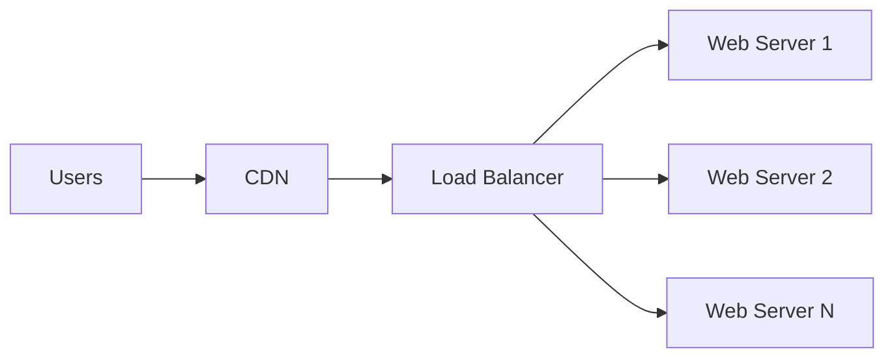
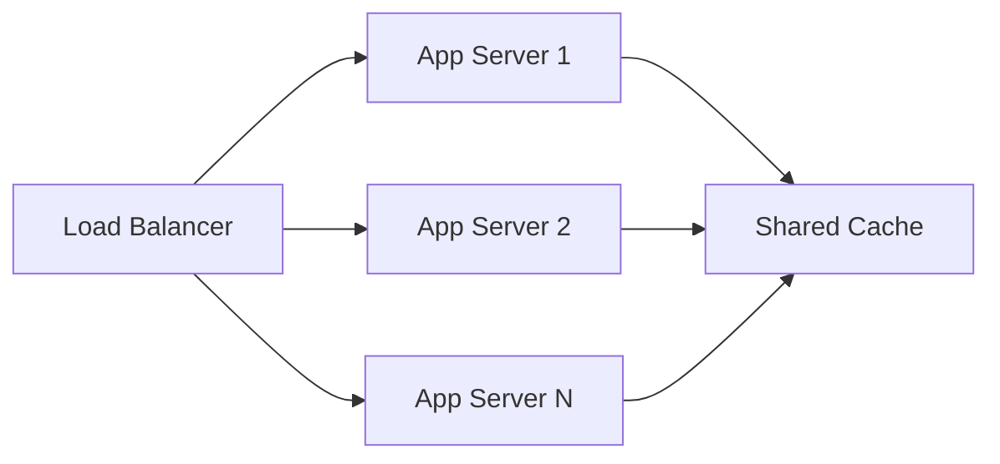
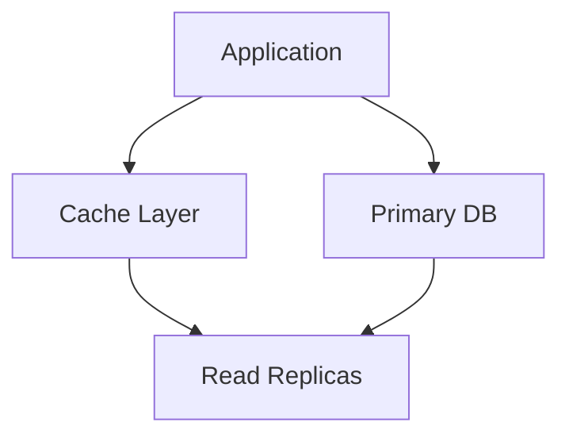
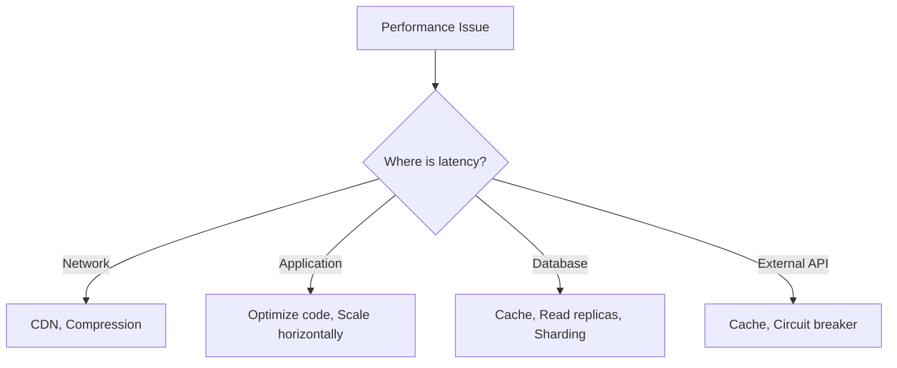

# Scalability

> The ability of a system to handle growing amounts of work by adding resources.

---

## Back to [[System Design]]

---

## What is Scalability?

Scalability is the capability of a system to handle a growing amount of work, or its potential to accommodate growth. A scalable system can maintain performance levels when workload increases.

---

## Types of Scaling

### Vertical Scaling (Scale Up)

> Adding more power to existing machines.

```
Before:                 After:
+--------+             +--------+
| 4 CPU  |    -->      | 16 CPU |
| 8 GB   |             | 64 GB  |
| Server |             | Server |
+--------+             +--------+
```

**Pros:**
- Simple to implement
- No code changes needed
- No distributed system complexity

**Cons:**
- Hardware limits exist
- Single point of failure
- Expensive at scale
- Downtime during upgrade

### Horizontal Scaling (Scale Out)

> Adding more machines to the pool.

```
Before:                 After:
+--------+             +--------+  +--------+  +--------+
| Server |    -->      | Server |  | Server |  | Server |
+--------+             +--------+  +--------+  +--------+
                              \       |       /
                               \      |      /
                            +-------------+
                            |Load Balancer|
                            +-------------+
```

**Pros:**
- Theoretically unlimited scaling
- Better fault tolerance
- Cost-effective (commodity hardware)
- No downtime for scaling

**Cons:**
- More complex architecture
- Requires code changes
- Data consistency challenges
- Network overhead

---

## Scaling Comparison

| Aspect | Vertical | Horizontal |
|--------|----------|------------|
| Cost | Expensive | Cost-effective |
| Complexity | Low | High |
| Failure Risk | High (SPOF) | Low |
| Data Consistency | Simple | Complex |
| Scaling Limit | Hardware limit | Theoretically unlimited |
| Downtime | Required | Not required |

---

## Scalability Patterns

### 1. Stateless Services

> Keep application servers stateless to enable easy horizontal scaling.

**Stateful (Bad):**
```
User A --> Server 1 (has session)
User A --> Server 2 (no session!) ❌
```

**Stateless (Good):**
```
User A --> Server 1 --> Shared Session Store
User A --> Server 2 --> Shared Session Store ✓
```

**Implementation:**
- Store session in Redis/Memcached
- Use JWT tokens
- Store state in database

### 2. Database Scaling

See [[Databases]] for detailed patterns.

**Read Scaling:**
```
                    +-- Read Replica 1
                   /
Write --> Primary --- Read Replica 2
                   \
                    +-- Read Replica 3
```

**Write Scaling:**
```
Shard 1 (Users A-M) --> DB 1
Shard 2 (Users N-Z) --> DB 2
```

### 3. Caching

See [[Caching]] for detailed patterns.

```
Request --> Cache Hit? --> Yes --> Return cached data
                |
                No
                |
                v
            Database --> Update Cache --> Return data
```

### 4. Asynchronous Processing

See [[Message Queues]] for detailed patterns.

```
Sync (Slow):
Request --> Process --> Response (blocks until done)

Async (Fast):
Request --> Queue --> Response (immediate)
                |
                v
           Worker processes later
```

---

## Scaling Strategies by Component

### Web Tier Scaling


- Use CDN for static content
- Load balancer for traffic distribution
- Auto-scaling groups

### Application Tier Scaling


- Stateless design
- Shared cache layer
- Service decomposition

### Data Tier Scaling


- Read replicas for read scaling
- Sharding for write scaling
- Caching layer

---

## Auto-Scaling

### Metrics to Monitor
- CPU utilization
- Memory usage
- Request count
- Queue depth
- Response latency

### Scaling Policies

```yaml
# Example Auto-Scaling Policy
Scale Up:
  - CPU > 70% for 5 minutes
  - Add 2 instances
  - Cooldown: 5 minutes

Scale Down:
  - CPU < 30% for 10 minutes
  - Remove 1 instance
  - Cooldown: 10 minutes

Limits:
  - Min instances: 2
  - Max instances: 100
```

### Scaling Triggers

| Metric | Scale Up | Scale Down |
|--------|----------|------------|
| CPU | > 70% | < 30% |
| Memory | > 80% | < 40% |
| Queue Depth | > 1000 | < 100 |
| Latency | > 500ms | < 100ms |

---

## Scalability Bottlenecks

### Common Bottlenecks

```
1. Single Database
   Solution: Read replicas, sharding, caching

2. Synchronous Processing
   Solution: Message queues, async workers

3. Session Affinity
   Solution: Stateless design, shared session store

4. Large File Storage
   Solution: Object storage (S3), CDN

5. Network Bandwidth
   Solution: Compression, CDN, edge computing
```

### Identifying Bottlenecks



---

## Capacity Planning

### Traffic Estimation
```
Daily Active Users (DAU): 1 million
Avg requests per user: 10
Daily requests: 10 million
QPS (average): 10M / 86400 = ~115 QPS
QPS (peak, 3x): ~350 QPS
```

### Storage Estimation
```
Users: 1 million
Data per user: 10 KB
Total: 10 GB
Growth rate: 10% monthly
1 year: ~30 GB
```

### Server Estimation
```
Each server handles: 1000 RPS
Peak traffic: 10,000 RPS
Servers needed: 10
With redundancy (2x): 20 servers
```

---

## Best Practices

1. **Design for failure** - Assume components will fail
2. **Start simple** - Optimize when needed
3. **Monitor everything** - You can't improve what you don't measure
4. **Cache aggressively** - But invalidate correctly
5. **Use async where possible** - Don't block on slow operations
6. **Shard early** - Resharding is painful

---

## Related Topics
- [[Load Balancing]] - Distributing traffic
- [[Caching]] - Improving performance
- [[Databases]] - Data layer scaling
- [[Message Queues]] - Async processing

---

## Tags
#scalability #horizontal-scaling #vertical-scaling #performance #system-design
