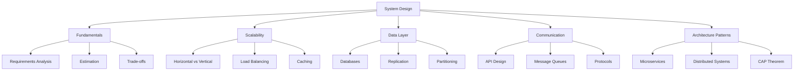

# System Design

> A comprehensive guide to designing scalable, reliable, and maintainable systems.

---

## Overview

System design is the process of defining the architecture, components, modules, interfaces, and data flow of a system to satisfy specified requirements. It's a crucial skill for software engineers, especially when building applications that need to handle millions of users.

---

## Topics Map

---

## Core Concepts

### Foundational Topics
- [[Fundamentals]] - Core concepts and approach to system design
- [[Scalability]] - Horizontal vs vertical scaling strategies
- [[Databases]] - SQL, NoSQL, and data storage patterns

### Infrastructure Components
- [[Load Balancing]] - Distributing traffic across servers
- [[Caching]] - Improving performance with caching layers
- [[Message Queues]] - Asynchronous communication patterns

### Architecture & Patterns
- [[Microservices]] - Building distributed service architectures
- [[Distributed Systems]] - CAP theorem and consistency patterns
- [[API Design]] - RESTful APIs, GraphQL, and gRPC

### Real-World Applications
- [[Case Studies]] - Designing real systems (URL shortener, Twitter, etc.)

---

## Learning Path

### Phase 1: Fundamentals
1. Start with [[Fundamentals]] to understand the approach
2. Learn [[Scalability]] concepts
3. Deep dive into [[Databases]]

### Phase 2: Infrastructure
4. Understand [[Load Balancing]]
5. Master [[Caching]] strategies
6. Learn [[Message Queues]]

### Phase 3: Advanced Patterns
7. Study [[Microservices]] architecture
8. Understand [[Distributed Systems]]
9. Master [[API Design]]

### Phase 4: Practice
10. Work through [[Case Studies]]

---

## Quick Reference

| Concept | Key Question | Related Topics |
|---------|--------------|----------------|
| Scalability | How to handle growth? | [[Scalability]], [[Load Balancing]] |
| Reliability | How to prevent failures? | [[Distributed Systems]], [[Message Queues]] |
| Performance | How to reduce latency? | [[Caching]], [[Databases]] |
| Maintainability | How to evolve the system? | [[Microservices]], [[API Design]] |

---

## Interview Framework

When approaching a system design interview:

1. **Clarify Requirements** (5 min)
   - Functional requirements
   - Non-functional requirements
   - Scale estimation

2. **High-Level Design** (10 min)
   - Draw main components
   - Define data flow
   - Identify APIs

3. **Deep Dive** (20 min)
   - Database schema
   - Scaling strategies
   - Handle edge cases

4. **Wrap Up** (5 min)
   - Discuss trade-offs
   - Future improvements
   - Bottlenecks

---

## Tags
#system-design #architecture #scalability #interview-prep
